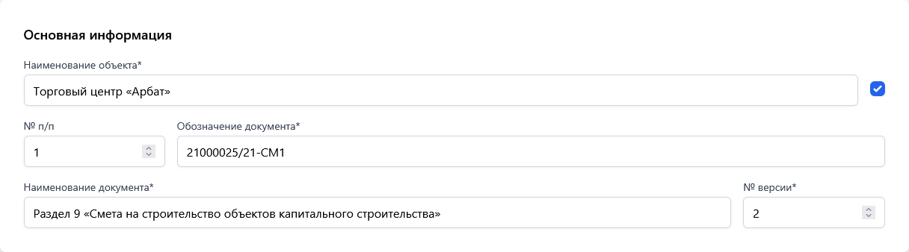
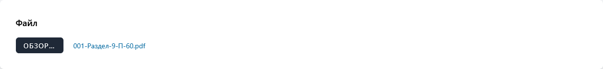
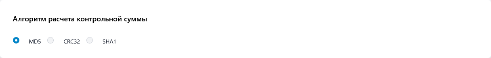
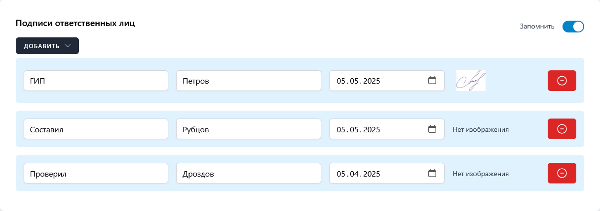
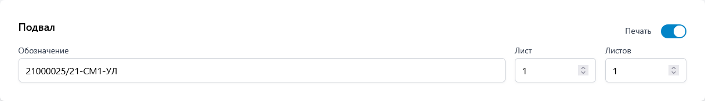
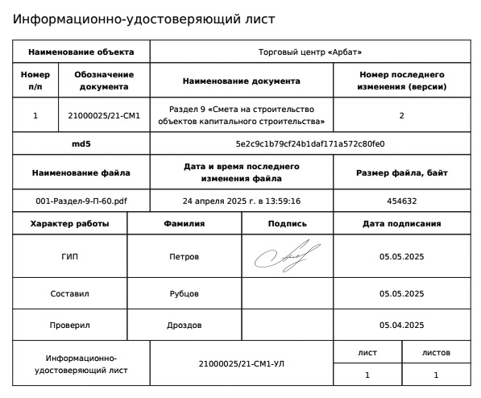

import { Aside } from "@astrojs/starlight/components";

Раздел «Конструктор» является основным элементом сервиса Quatros по формированию ИУЛ. С применением инструментов конструктора вы сможете полностью удовлетворить все предъявляемые требования к заполнению и формированию ИУЛ.

Форма конструктора включает пять разделов, которые выстроены в логическом порядке рекомендуемой формы УЛ. Последний, шестой раздел содержит настройки формируемого документа:

- Основная информация.
- Файл.
- Алгоритм расчета контрольной суммы.
- Подписи ответственных лиц.
- Штамп.
- Настройки.

## Основная информация

### Наименование объекта\*

В этом поле внесите краткую информацию об объекте, для которого создается **удостоверяющий лист (УЛ)**. Данное поле не входит в официальный перечень формы, однако оно необходимо для идентификации объекта в разделе «История».

_\*поле обязательное для заполнения._

<Aside type="tip">
  Если вам не нужно, чтобы информация из этого поля отображалась в выходном
  документе, просто уберите галочку напротив него.
</Aside>

### № п/п

Порядковый номер **документа электронного (ДЭ)** при оформлении нескольких ДЭ одновременно. При оформлении УЛ на один ДЭ графу не заполняют.

### Обозначение документа\*

Обозначение ДЭ, который оформляют данным УЛ.

_\*поле обязательное для заполнения._

### Наименование документа\*

Наименование документа(ов).

_\*поле обязательное для заполнения._

### № версии\*

Номер последнего изменения (версии) ДЭ;

_\*поле обязательное для заполнения._

## Файл

В этом блоке выберите файл с локального диска, по результатам обработки которого будет получена информация о наименовании, дате и времени последнего изменения, размере, а также контрольной сумме, на основании выбранного алгоритма.

На время обработки файла кнопка «Сформировать» будет недоступна на время, необходимое для обработки информации.

<Aside type="note">
  Благодаря применению современных методов и алгоритмов обработки данных, сервис
  не имеет ограничений по размеру и типу файла. Обработка файлов объемом в
  несколько сотен мегабайт занимает всего лишь доли секунды. 🚀
</Aside>

## Алгоритм расчета контрольной суммы

В зависимости от требований доступны три алгоритма расчета контрольной суммы:

- MD5 (англ. Message Digest 5) — 128-битный алгоритм хеширования;
- CRC32 (англ. Cyclic redundancy check) — алгоритм нахождения контрольной суммы, предназначенный для проверки целостности данных.
- SHA1 (англ. Secure Hash Algorithm 1) — алгоритм криптографического хеширования.

## Подписи ответственных лиц

Добавляйте подписи ответственных лиц любым удобном для вас способом: либо, добавив пустую строку, для дальнейшего заполнения машинным или рукописным способом, либо выбрав из справочника, в котором вы можете хранить наиболее используемые данные о лицах, подписывающих УЛ. Конечно, вы также вольны комбинировать эти способы одновременно.

Справочником подписей также предусмотрено использование факсимиле при необходимости.

<Aside type="tip">
  Для того, чтобы изображение подписи было качественным желательно соблюдать
  некоторые условия: соотношение сторон 3:2 (например, ширина - 150 px, высота
  100 px); разрешение изображения не менее 72 dpi (пикселей на дюйм). Для
  лучшего результата поэкспериментируйте немного!
</Aside>

Опция **«Запомнить»** позволяет сохранить последний набор подписей, чтобы вам не пришлось каждый раз набирать его заново для последующих документов.

<Aside type="note">
  Количество строк для подписей устанавливает организация - разработчик УЛ.
  Допускается при необходимости удалять или добавлять графы и изменять их
  расположение.
</Aside>

## Штамп

Используйте опцию **«Печать»** для контроля видимости информации из раздела «Штамп» в выходном
документе.

## Настройки

Сохраняйте в удобном для вас формате. Поддержка нескольких типов файлов для выгрузки сформированного ИУЛ:

- DOCX;
- PDF;
- HTML.

Настройте начертание заголовков в выходном документе по своему вкусу:

- regular (обычный);
- bold (жирный);
- italic (наклонный);
- bold italic (жирный наклонный).

## Формирование ИУЛ

Всё готово для формирования ИУЛ!

Для того чтобы скачать или вывести на экран браузера (при выборе формата HTML) удостоверяющий лист нажмите кнопку **«Сформировать»**.

### Пример выходного документа

<Aside type="note">
  Необходимо отметить, что после успешного формирования выходного документа все
  настройки формы сохранятся (кроме значений полей и выбранного файла) и будут
  использованы в дальнейшем, пока вы не измените их.
</Aside>
