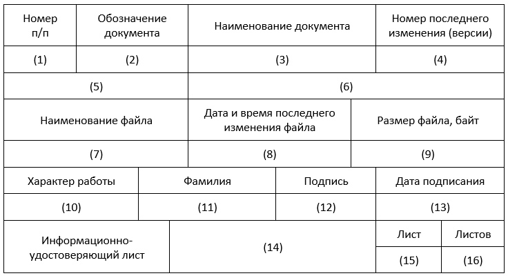

import { Aside } from "@astrojs/starlight/components";

[Quatros](https://quatros.ru "Конструктор ИУЛ") — это полнофункциональный сервис для формирования и систематизации **информационно-удостоверяющих листов (ИУЛ)**.

Создание ИУЛ вручную – это довольно трудоемкий и затратный процесс, который может занять значительную часть вашего рабочего времени. Любое изменение в исходных файлах проектной документации требует пересчета контрольных сумм с использованием специальных программных средств, а также обновления даты и размеров файлов.

Используя наш инструмент, вы автоматизируете и значительно упростите себе эту задачу.

### Образец формы ИУЛ

### Описание граф

#### В графах удостоверяющего листа (УЛ) указывают:

1. порядковый номер документа электронного (ДЭ) при оформлении нескольких ДЭ одновременно. При оформлении УЛ на один ДЭ графу не заполняют;
2. обозначение ДЭ, который оформляют данным УЛ;
3. наименование документа(ов);
4. номер последнего изменения (версии) ДЭ;
5. алгоритм расчета контрольной суммы;
6. значение контрольной суммы (некоторое значение, рассчитанное из последовательности данных путем применения определенного алгоритма);
7. наименование (имя) файла ДЭ с относительным путем в пакете;
8. дата и время последнего изменения файла;
9. размер файла;
10. характер работы, выполняемой лицом, подписавшим документ или должность;
11. фамилии лиц, подписавших документ;
12. подписи лиц, фамилии которых указаны в графе 10;
13. дату подписания ДЭ лицами, фамилии которых указаны в графе Подписи лиц, разработавших данный(е) документ(ы) и ответственных за нормоконтроль, являются обязательными;
14. обозначение УЛ;
15. порядковый номер страницы УЛ;
16. общее количество страниц в УЛ (указывают только на первой странице). При оформлении УЛ на одной странице графы 15 и 16 не заполняют.

<Aside title="Обратите внимание">
  Форма выходного документа, формируемая сервисом, соответствует требованиям
  ГОСТа Р 21.101-2020.
</Aside>
