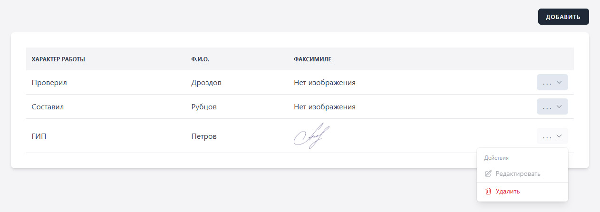

import { Aside } from "@astrojs/starlight/components";

Раздел «Подписи» предоставляет удобный инструмент (справочник) для хранения и редактирования информации о лицах, подписывающих информационно-удостоверяющий лист.

В этом разделе вы сможете создавать о подписантах, такие как характер работы, выполняемой лицом, подписавшим документ или должность и фамилии лиц, подписавших документ.

Кроме того, используете возможность прикреплять изображения сканов подписей **(факсимиле)**, что обеспечивает дополнительный уровень удобства при работе с документации.

<Aside type="tip">
  Добавление изображение подписи, конечно, не является обязательным. Для
  подписания документа от руки просто проигнорируйте выбор файла, либо в
  «Конструкторе» добавьте пустую подпись, что позволит заполнить все поля
  прописью.
</Aside>
